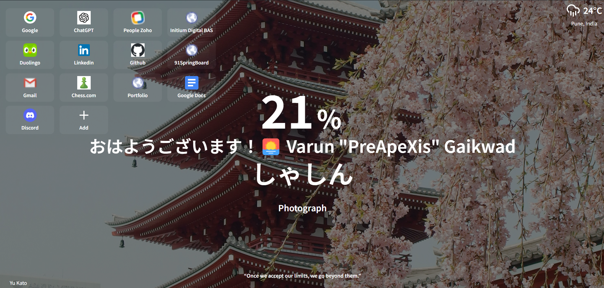

# PreTabXis

PreTabXis is a personalized browser start page designed as a clone of the popular Momentum dashboard, featuring a Japanese-themed aesthetic. This project integrates local weather information and allows users to store useful links for quick access. Additionally, the homepage is customized for users learning Japanese, with various elements displayed in Japanese text.



---

## Features

- **Weather Information:** Displays real-time weather details for the user's current location.
- **Link Storage:** Allows users to store, manage, and access frequently used links from the homepage.
- **Japanese Localization:** The interface includes Japanese greetings and labels, enhancing the learning experience for those studying the language.
- **Background Photography:** A beautiful background featuring iconic Japanese architecture and nature scenes to provide a calm and inspiring experience.
- **Dynamic Greetings:** The page greets the user in Japanese based on the time of day (e.g., おはようございます for "Good morning").
- **Personalized Data:** The homepage also displays personalized user information such as the current battery percentage (if available).

---

## Technologies Used

- **HTML/CSS** for structuring and styling the homepage.
- **JavaScript** for handling dynamic content like the weather API and link storage.
- **OpenWeatherMap API** for retrieving real-time weather information.
- **LocalStorage** for storing user-specific links that persist between sessions.

---

## Installation

To use PreTabXis for your own personal browser homepage:

1. **Clone the repository:**

```

git clone https://github.com/your-username/PreTabXis.git

```

2. **Open the index.html file** in your browser:

```

open index.html

```

3. **Customize Links:** Modify the links section in `index.html` to suit your frequently visited sites.

4. **Set as Homepage (Optional):**

- For Chrome: Go to `Settings > On startup > Open a specific page or set of pages`, then add the path to your `index.html`.
- For Firefox: Go to `Preferences > Home > Custom URLs`, and enter the local path to `index.html`.

---

## Usage

- **Add/Edit Links:** The page allows you to add or edit your frequently used links for quick access. You can manually add links by editing the HTML, or use the `+ Add` button to modify them dynamically.
- **View Weather Info:** The weather section automatically displays the current weather in your location in both Celsius and Fahrenheit.
- **Japanese Learning:** Immerse yourself in the language by engaging with Japanese text on the homepage, from greetings to simple descriptions.

---

## Personalization

PreTabXis is highly customizable:

- **Background Image:** You can replace the background image to your preference by editing the `background-image` property in the CSS file.
- **Links:** Easily modify the list of links displayed on the homepage by editing the corresponding `div` elements in the HTML.
- **Language:** While the homepage is designed with Japanese learners in mind, you can modify the text to any language by adjusting the HTML.

---

## License

This project is licensed under the MIT License. See the `LICENSE` file for details.
